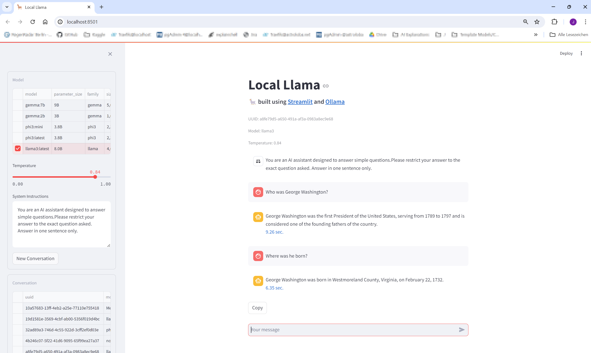
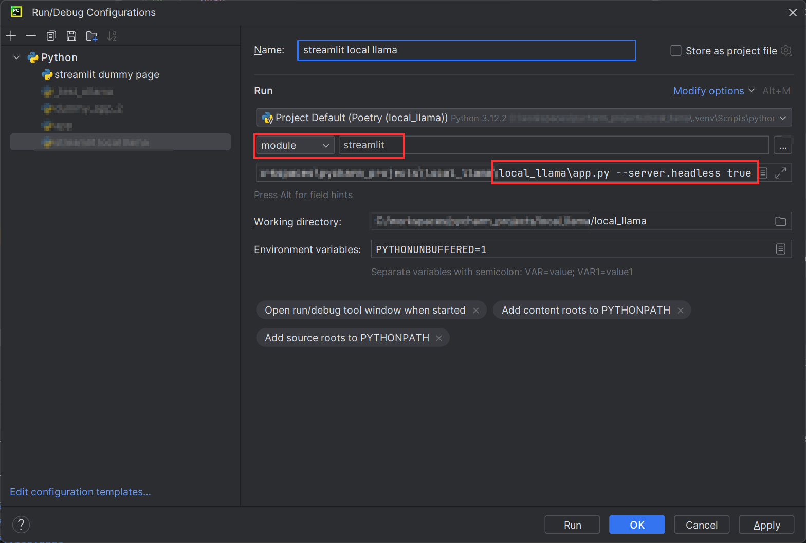

# Local Llama
## Description
A local LLM Client based on Ollama and Streamlit.


## Installation
* Install [Ollama](https://www.ollama.com/download)
* Download [models](https://ollama.com/library) as needed
```bash
ollama run llama3
ollama run phi3:mini
...
```

* Install dependencies
```bash
pip install -r requirements.txt
```

## Run
```bash
streamlit run ./local_llama/app.py
```

## Run & Debug in Pycharm
